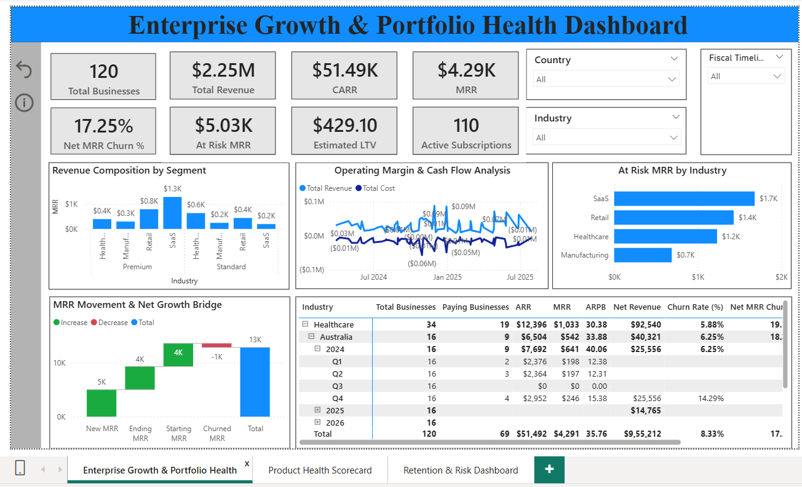
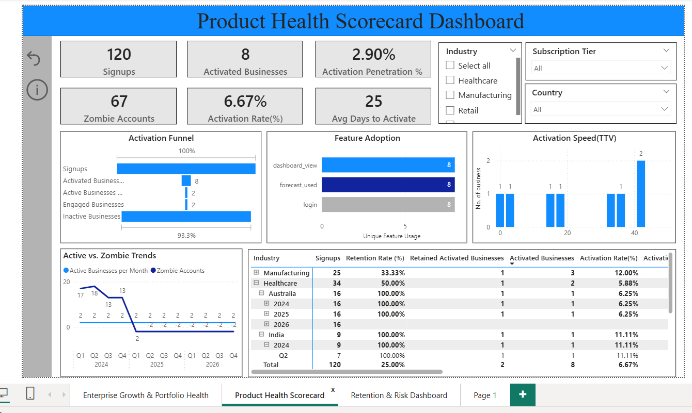
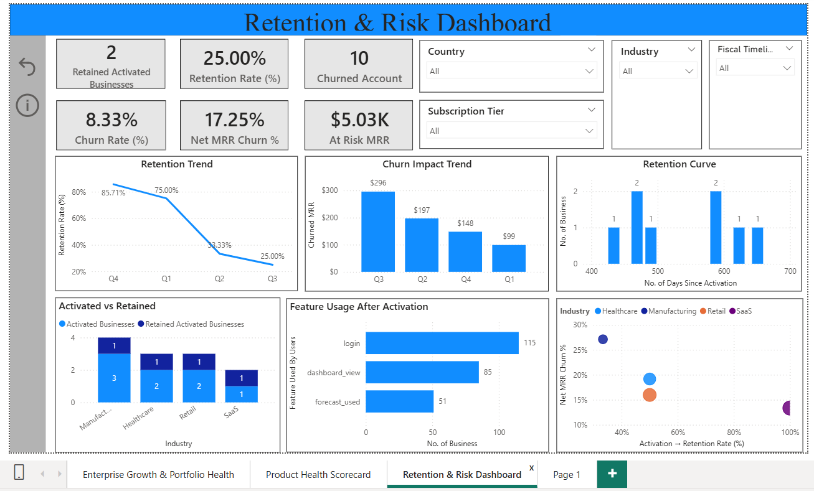

# Dashboards Overview

This folder contains screenshots and explanations of the Power BI dashboards
built for the Finsight Product Decision System.

Dashboards are designed for three personas:
- Executive Leadership
- Product Management
- Operations / Customer Success

## 📊 Dashboards Overview

This project includes three Power BI dashboards designed for different stakeholder personas.

### 1️⃣ Executive Dashboard — Business Health
**Persona:** CEO / Leadership  
**Purpose:** Quick view of growth, revenue stability, and churn risk.

**Key Questions Answered:**
- Are we growing or stagnating?
- Where is revenue concentrated?
- Is churn threatening future revenue?

📷 Screenshots:
- Executive Overview KPIs
- MRR Bridge (Growth vs Churn)
- Revenue Composition by Segment

### 2️⃣ Product Dashboard — Activation & Engagement
**Persona:** Product Manager  
**Purpose:** Understand whether users reach value and which features drive retention.

**Key Questions Answered:**
- Where do users drop off?
- How fast do users reach activation?
- Which features matter?

📷 Screenshots:
- Activation Funnel
- Feature Adoption
- Time to Value Distribution

### 3️⃣ Operations Dashboard — Retention & Risk
**Persona:** Customer Success / Operations  
**Purpose:** Identify churn risk early and prioritize intervention.

**Key Questions Answered:**
- Which accounts are at risk?
- How much revenue is endangered?
- Which segments need attention?

📷 Screenshots:
- At-Risk MRR by Industry
- Retention Trend
- Risk Action Table

